It’s super helpful to verify your smart contract so that you can read and write from it on sites like etherscan or polygonscan, depending on what blockchain you are using. So i’m going to show you really quick and simple how to do this!

First, we are using <b>Hardhat</b> as our Ethereum development environment, so I am just going to assume for this mini-tutorial that you already have a basic hardhat sample project up and running and that you have a contract ready to be deployed, or already deployed.

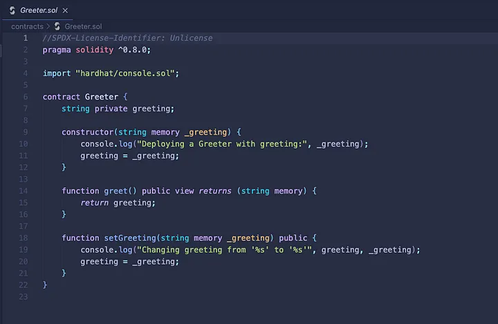
<small><i>Greeter.sol boilerplate contract</i></small>

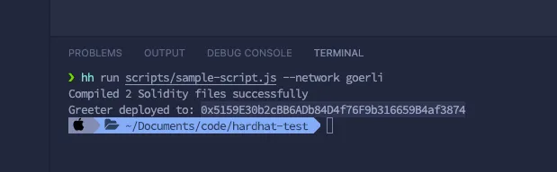
<small><i>Script for deploying Greeter.sol to the Goerli testnet</i></small>

So right here I am just using the default boilerplate Greeter.sol contract given when installing hardhat. Below that is the script I ran to deploy this contract to the Goerli testnet!

And now, if we jump on over to https://goerli.etherscan.io/ and put in the contract address our Greeter contract was deployed to (0x5159…f3874), we will see our brand new contract!

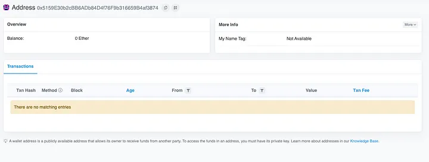
<small><i>Our new deployed Greeter.sol contract</i></small>

But you’ll notice that it’s missing the contract section with the little green checkmark to prove that the contract has been verified. For example, here is the contract for CrytpoPunks…

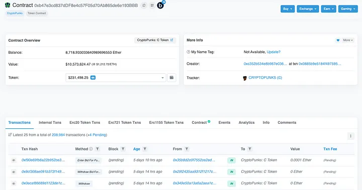
<small><i>CryptoPunks Contract Address</i></small>

Notice how there is a little section that says contract, and has a green checkmark? That means that contract has been verified, and that’s what we are going to do right now!

First things first, we are going to need to use the hardhat plugin ‘hardhat-verify’, so let’s head on over to the official hardhat website and check it out! [hardhat.org/plugins/nomiclabs-hardhat-etherscan](https://hardhat.org/plugins/nomiclabs-hardhat-etherscan)

In our project directory, we are going to run the following command to install the hardhat-verify plugin.

```
npm install --save-dev @nomiclabs/hardhat-etherscan
```

<b>DO NOT</b> forget this part.. we also have to require it in our hardhat.config.js file. So jump over to that file and at the top require hardhat-verify like this:

```
require("@nomiclabs/hardhat-etherscan");
```

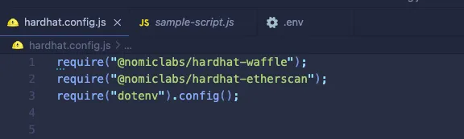
<small><i>Our require statements in our hardhat.config file</i></small>

Okay, so now we have it installed, perfect! Now we just have to add our etherScan API key to our <i>module.exports</i> at the bottom of our <i>hardhat.config.js</i> file. That looks like this …

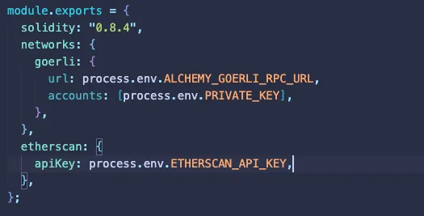

Note: I am using dotenv, in order to store environment variables for security reasons.. I <b>highly suggest</b> you do the same! If you haven’t used it before it’s super easy. Just install the dotenv npm package with:

```
npm i dotenv
```

and then add it as a require statement in your hardhat config file <i>(see above pic)</i>. Then you’re free to create a .env file and store variables there much more safely.

Anyways, now we are finally ready to go ahead and run our verify script. So there are 2 ways of doing this.

1. <b>Simple constructor</b> (contract that only has one constructor argument)
2. <b>Complex constructor</b> (contract that has more than one constructor argument)

So go ahead and check your contract and see how many arguments your constructor function needs. In the case of the Greeter.sol contract, we can see that it only takes in 1, that is <i>_greeting</i>.

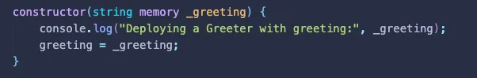
<small><i>Simple constructor</i></small>

So the script we need to use in order to verify our contract looks like this:

```
npx hardhat verify --network mainnet DEPLOYED_CONTRACT_ADDRESS "Constructor argument 1"
```

1. Calling hardhat and saying what we want to do (in this case verify)
2. Stating which network our contract we want to verify is on
3. Putting the actual contracts address it was deployed to (0x5159…f3874)
4. And then finally as a string, we want to pass the argument. So our constructor is looking for 1 argument, which is to be a string called _greeting. You need to pass it the <b>SAME</b> thing you did when deployed the contract initially. So if you deployed it with “Heyo, i’m the greeting message”, then this is also what you have to put for the verify script. This is so etherscan can verify that the contract is the same bytecode.

So, our script would look like this:

```
npx hardhat verify --network goerli 0x5159E30b2cBB6ADb84D4f76F9b316659B4af3874 “Heyo, i’m the greeting message”
```

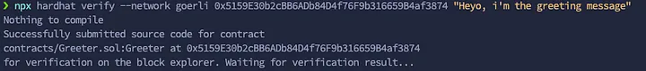
<small><i>Running verify script</i></small>

Then just, wait for it to successfully verify with etherscan, and check out your contract address again on etherscan and <b>BAM</b>, we did it!

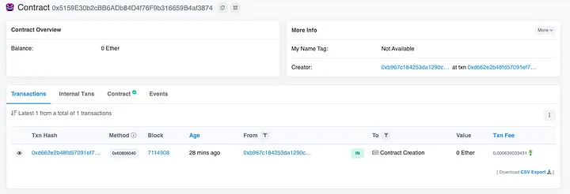

Now you can read & write to your contract using the contract tab! For example, let’s go ahead and read from our greet function.

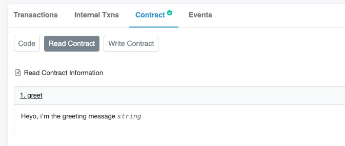

We can see that it is the message we passed our constructor when we deployed, awesome!

<b>BUT</b>, if you have a complex constructor with more than one arguments, or complex arg types like mappings or structs then we will do this a more efficient way.

So, the way I do this is to create a separate JS file in my project directory, and because it’s for our constructor arguments, i’ll call it <i>args.js</i>

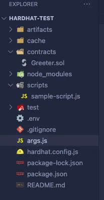
<small><i>args.js</i></small>

In our args.js file I will just do a simple module.exports and open up an array to put in all my arguments. Here is what it will look like:

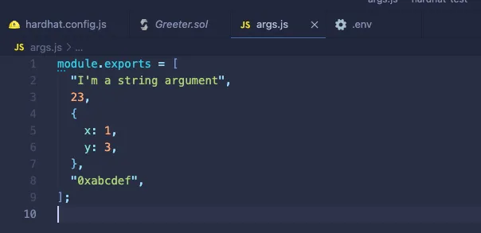

Now we’re all ready to go! Same as the simple constructor, we just need to run our hardhat-verify script. It is very similar, but this time we are going to just put our args file right in the script.

```
npx hardhat verify --constructor-args arguments.js DEPLOYED_CONTRACT_ADDRESS
```

What it looks like in action:

```
npx hardhat verify --constructor-args args.js --network goerli 0x5159E30b2cBB6ADb84D4f76F9b316659B4af3874
```

and that’s all there is to it :)

So that shows how to verify your contract with hardhat using one or more constructor arguments. If you have any questions or comments drop them in the comment section and i’ll get back to you.

Cheers, good luck and happy coding! 👩‍💻🦄